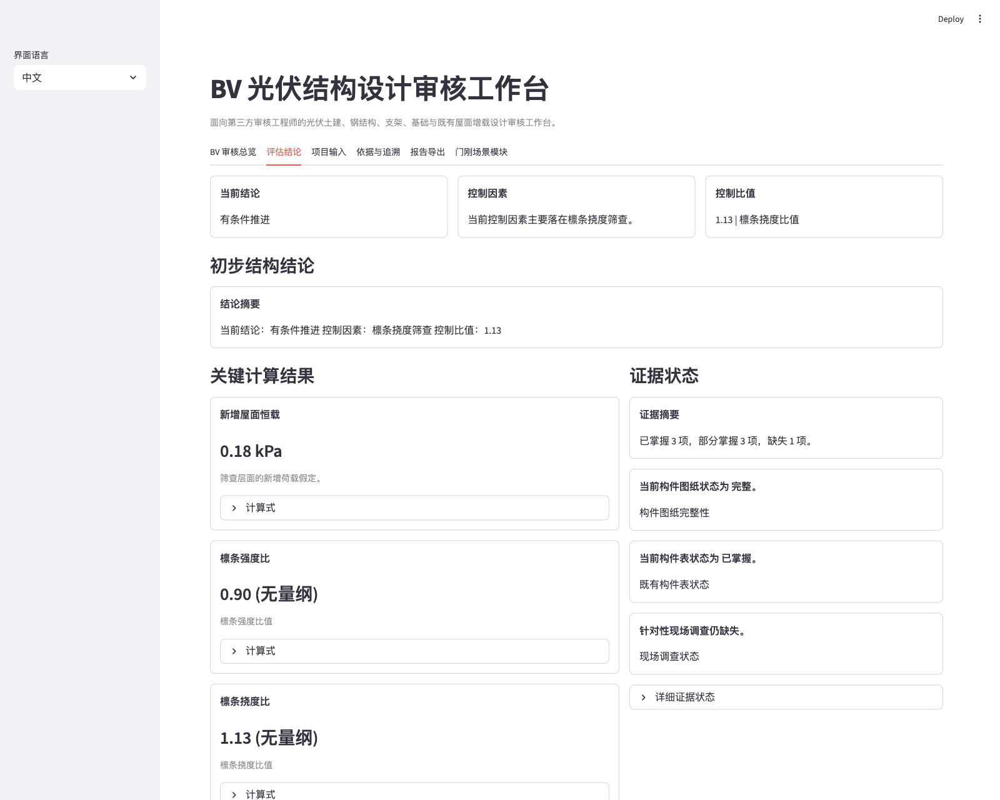
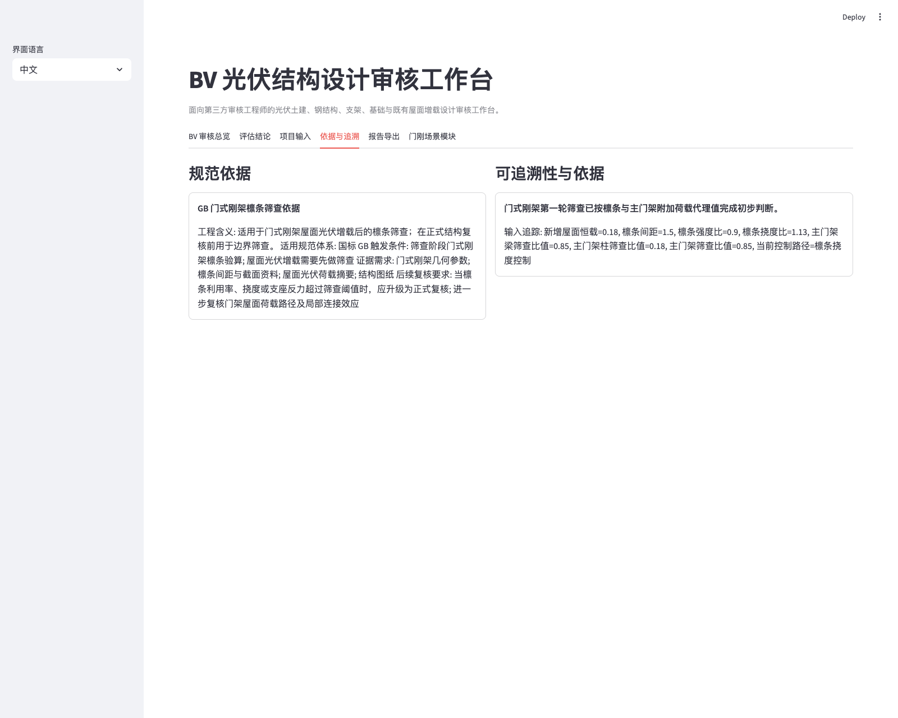
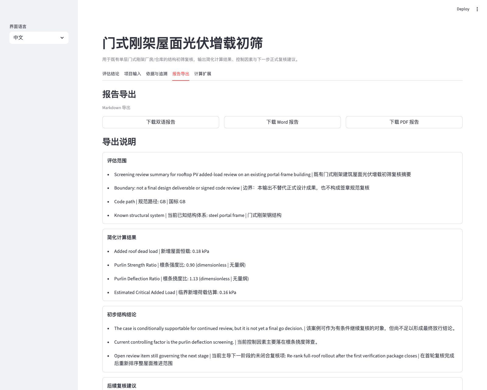

# BV PV Design Review Workbench

BV 光伏结构设计审核工作台，面向第三方光伏项目的土建、钢结构、支架、基础等专业设计审核支持场景。

它不是聊天机器人，不是 UI 包装的规则表单，也不是正式结构设计软件；它的定位是把第三方 PV design review 前期最关键的工程判断数字化，帮助甲方技术负责人、投资方技术团队或独立审核顾问快速看懂：项目当前能否进入下一轮正式复核，为什么，以及下一步该补什么。

当前仓库保留了既有结构筛查 deterministic kernel，并将其作为第一个嵌入场景模块落地：**门式刚架屋面光伏增载场景模块**。

## 这个项目解决什么问题

在第三方光伏设计审核中，真正卡住项目推进的，往往不是正式计算书本身，而是更靠前的一层问题：

- 当前资料条件下，设计审核是否具备继续推进条件
- 控制因素到底落在主体钢结构、次结构、支架体系还是基础路径
- 现有图纸、现场调查、厂家资料和荷载假设是否足以形成可辩护的审核包
- 如果现在不能推进，缺的到底是什么

这个项目把这类前期筛查逻辑做成一个可运行、可追溯、可导出的工程工具台。

## 核心能力

- **第三方审核工作台定位**：支持 PV 项目的土建、钢结构、支架、基础等专业审核视角统一归集。
- **场景模块化**：以门式刚架屋面光伏增载场景模块为首个内嵌模块，后续可扩展到更多审核对象。
- **screening kernel**：使用确定性内核输出关键简化计算，而不是直接让大模型生成结论。
- **保守假设台账**：资料缺失时，不是直接失效，而是显式记录保守假设和边界。
- **依据与追溯**：结论可回溯到规范路径、触发条件、证据需求和输入来源。
- **工程化输出**：可导出 Markdown / Word / PDF 格式的结构初筛复核摘要。

## 为什么这不是一个普通 AI demo

- 结论不是 LLM 说了算，而是来自确定性 screening kernel。
- 输出不是一段泛泛解释，而是工程对象、简化计算、控制因素、依据和后续动作的组合。
- 主界面不是聊天框，而是围绕 `评估结论 / 依据与追溯 / 报告导出` 组织的决策界面。
- 产品边界写得很清楚：**screening-level only**，不冒充正式设计、有限元分析、签章复核或施工图设计。

## 关键界面

### 1. 评估结论



首屏聚焦 `初步结构结论 / 控制因素 / 关键计算结果 / 证据状态`，让技术负责人先看到“是否能进入下一阶段正式复核”。

### 2. 依据与追溯



展示依据条目、触发条件、证据需求和输入追踪，证明结论不是黑箱。

### 3. 报告导出



支持 Markdown / Word / PDF 导出，适合内部讨论、甲方汇报和顾问交接。

## 快速运行

```bash
python -m pip install -e ".[dev]"
python -m streamlit run app.py --server.port 8503
```

打开：

- [http://localhost:8503](http://localhost:8503)

如果你只想快速看懂 demo，建议阅读：

- [Demo Guide](docs/showcase/demo-guide.md)
- [Project Brief](docs/showcase/project-brief.md)

## 当前边界

- 当前工作台首个模块聚焦于**门式刚架 + 屋面光伏增载**场景
- 支持 `GB / AISC / Eurocode` 的规范路径选择
- 当前属于 **screening-level 结构复核**
- 不替代正式计算书、有限元分析、顾问签章复核或施工图设计

## 为什么这个项目有代表性

这个项目的代表性不只在于“做了一个结构工具”，而在于它把多个层面收成了一套产品：

- 工程场景定义
- 领域对象建模
- 筛查计算与规则边界
- 依据与 traceability
- 报告导出
- 面向决策者的展示界面

它体现的是把真实工程问题定义、工具架构和产品落地打通的能力，而不是只做单点算法或单点界面。
